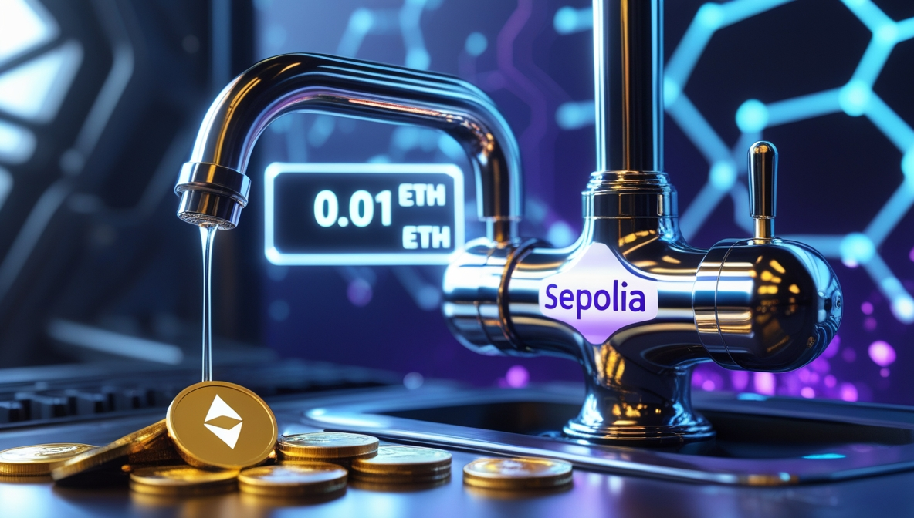

# 🌍 Sepolia Testnet Faucet | Sepolia Тестовая Сеть Кран

[English](#english) | [Русский](#русский)

---

## English

  

### Description
Sepolia Testnet Faucet is a simple faucet for distributing test ETH on the Sepolia network. Users can receive **0.01 ETH** every 24 hours per address and IP. To request, users must connect their wallet via MetaMask and complete Google reCAPTCHA v2. A small gas fee is required for the transaction.

This project is hosted on GitHub Pages and serves as a static interface for interacting with the smart contract.

### Features
- **Distribution**: **0.01 ETH** per address every 24 hours.
- **IP Restriction**: One request per IP every 24 hours.
- **Captcha**: Google reCAPTCHA v2 protection.
- **Balance Display**: Shows the current contract balance.
- **Gas Fee**: The user covers a small gas fee.

### How to Use
1. **Go to the website**: Open [https://mrgunkin.github.io/sepolia-faucet/](https://mrgunkin.github.io/sepolia-faucet/) in your browser.
2. **Connect Wallet**: Click "Connect Wallet" and link your MetaMask wallet. Ensure you're on the Sepolia network.
3. **Pass the Captcha**: Complete Google reCAPTCHA verification.
4. **Request ETH**: Click "Request 0.01 ETH" and confirm the transaction in MetaMask (you need test ETH to cover gas fees).
5. **Wait for the next request**: If 24 hours haven’t passed since your last request, a countdown timer will appear.

### Installation & Setup (For Developers)
1. **Clone the repository**:
   ```sh
   git clone https://github.com/your-username/sepolia-faucet.git
   cd sepolia-faucet
   ```
2. **Update the Contract**:
   - Replace `contractAddress` in `index.html` with your contract's address.
   - Ensure `abi.json` contains the latest contract ABI.
3. **Deploy on GitHub Pages**:
   - Upload `index.html` and `abi.json` to your repo’s root.
   - Enable GitHub Pages (main branch, /root folder).
4. **Fund the Faucet**:
   - Send test ETH to the contract address via MetaMask or Remix.

### Smart Contract
- **Address**: `0x4E1830a4A9b3F915F26e133AA141B065c8b3Bf41`
- **Network**: Sepolia Testnet
- **Contract Source Code**: Available in `SepoliaFaucet.sol`

### Requirements
- Installed MetaMask connected to Sepolia.
- Small amount of test ETH for gas fees (get from other faucets if needed).

### License
This code is provided "as is" without any warranties. The author is not responsible for any losses or issues arising from using this software. You are free to use, modify, and distribute this code at your own risk.

### Acknowledgments
- **Google reCAPTCHA** for bot protection.
- **Web3.js** for blockchain interactions.
- **Sepolia Testnet** for the testing environment.

### Author
- **mrgunkin** [GitHub Profile](https://github.com/mrgunkin)
- **For issues or suggestions, create an issue or contact the author!**

---

## Русский

  

### Описание
Sepolia Testnet Faucet — это простой кран для раздачи тестовых монет в сети Sepolia. Пользователи могут получать **0.01 ETH** каждые 24 часа на один адрес и IP. Для запроса требуется подключение кошелька через MetaMask и прохождение капчи Google reCAPTCHA v2. Транзакция требует небольшой комиссии за газ.

Проект размещён на GitHub Pages и представляет собой статический интерфейс для взаимодействия со смарт-контрактом.

### Особенности
- **Раздача**: **0.01 ETH** на адрес каждые 24 часа.
- **Ограничение по IP**: один запрос с одного IP раз в 24 часа.
- **Капча**: защита от ботов через Google reCAPTCHA v2.
- **Баланс**: отображает текущий баланс контракта.
- **Комиссия**: небольшая плата за газ оплачивается пользователем.

### Как использовать
1. **Перейдите на сайт**: Откройте [https://mrgunkin.github.io/sepolia-faucet/](https://mrgunkin.github.io/sepolia-faucet/) в браузере.
2. **Подключите кошелёк**: Нажмите "Connect Wallet" и подключите MetaMask. Убедитесь, что выбрана сеть Sepolia.
3. **Пройдите капчу**: Подтвердите Google reCAPTCHA.
4. **Запросите ETH**: Нажмите "Request 0.01 ETH" и подтвердите транзакцию в MetaMask (нужны тестовые ETH для оплаты газа).
5. **Дождитесь следующего запроса**: Если 24 часа с последнего запроса не прошли, появится таймер ожидания.

### Установка и настройка (для разработчиков)
1. **Клонируйте репозиторий**:
   ```sh
   git clone https://github.com/ваш-username/sepolia-faucet.git
   cd sepolia-faucet
   ```
2. **Обновите контракт**:
   - Замените `contractAddress` в `index.html` на адрес вашего контракта.
   - Убедитесь, что `abi.json` содержит актуальный ABI контракта.
3. **Разместите на GitHub Pages**:
   - Загрузите `index.html` и `abi.json` в корень репозитория.
   - Включите GitHub Pages (ветка main, папка /root).
4. **Пополните кран**:
   - Отправьте тестовые ETH на адрес контракта через MetaMask или Remix.

### Смарт-контракт
- **Адрес**: `0x4E1830a4A9b3F915F26e133AA141B065c8b3Bf41`
- **Сеть**: Sepolia Testnet
- **Исходный код контракта**: Доступен в `SepoliaFaucet.sol`

### Требования
- Установленный MetaMask с подключением к Sepolia.
- Небольшое количество тестовых ETH для оплаты комиссии за газ.

### Лицензия
Код предоставляется "как есть" без каких-либо гарантий. Автор не несёт ответственности за возможные убытки или проблемы при использовании. Использование, модификация и распространение кода на ваш страх и риск.

### Благодарности
- **Google reCAPTCHA** за защиту от ботов.
- **Web3.js** за взаимодействие с блокчейном.
- **Sepolia Testnet** за тестовую среду.

### Автор
- **mrgunkin** [GitHub Profile](https://github.com/mrgunkin)
- **Если у вас есть вопросы или предложения, создавайте issue или пишите автору!**
